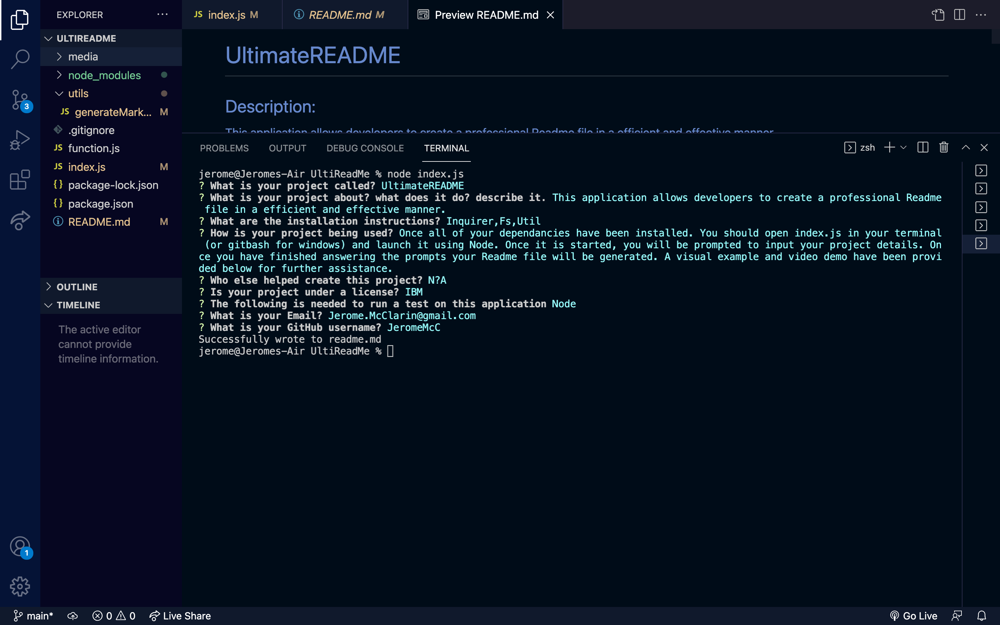

# UltimateREADME
  
## Description: 
This application allows developers to create a professional Readme file in a efficient and effective manner.
## Table of Contents

* [Installation](#installation)
* [Usage](#usage)
* [Contribution](#contribution)
* [License](#license)
* [Test](#test)
* [Questions](#questions)

## Installation 
The following dependencies need to be installed to run the application properly:Inquirer,Fs,Utils

## Usage: 
Once all of your dependancies have been installed. You should open index.js in your terminal (or gitbash for windows) and launch it using Node. Once it is started, you will be prompted to input your project details. Once you have finished answering the prompts your Readme file will be generated. A visual example and video demo have been provided below for further assistance. Visual Guide:  Video Demo:https://watch.screencastify.com/v/ARlzn45m9qmEv9xMeIq1

## Contribution
Contributors:N/A

## License
  IBM
  []'https://opensource.org/licenses/IPL-1.0'

## Test:
Node

## Questions: 
For any additional questions or issues you encounter; please contact me via email at Jerome.McClarin@gmail.com or visit my GitHub at [JeromeMcC](https://github.com/JeromeMcC/).
